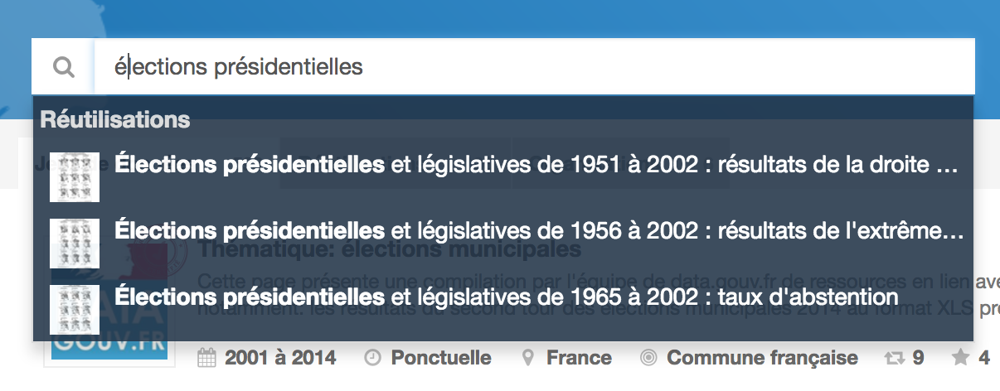
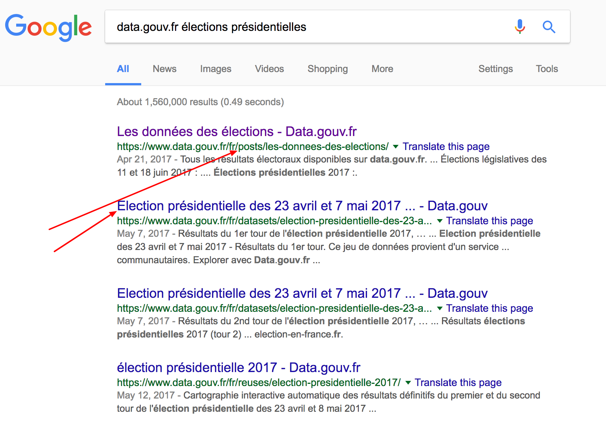
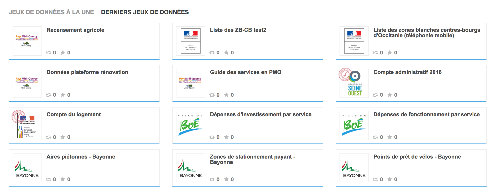

# Entretien avec Joël Gombin

## Présentation

Joël accompagne les structures publiques et privées à l'_ouverture des données_ ainsi qu'à leur _réutilisation_ sous forme de :

1. Conseil ;
2. Formation (culture, technique — avec [R](https://www.r-project.org/) notamment) ;
3. Médiation (la CAF de Paris par exemple).

Joël et [Datactivist](http://datactivi.st/) réalisent l'évaluation indépendante des engagements de la France au sein de l'[Open Government Partnership](https://www.opengovpartnership.org/) (_OGP_), mais aussi des engagements de la _Ville de Paris_ ([lire sa candidature à l'OGP](https://www.opengovpartnership.org/sites/default/files/Paris%20Candidacy%20OGP_0.pdf)).

Joël est spécialisé dans la sociologie électorale quantitative. Pratique qu'il exerce depuis 2005.

> Quand tu ouvres tes données, tu ne sais pas comment elles vont être utilisées.

Enfin, Joël a participé à la création de [DODOData](http://www.dododata.io/) pour aider à **automatiser les demandes** à la [Commission d'Accès aux Documents Administratifs](http://www.cada.fr/) (_CADA_) ainsi que le **retraitement des données**, notamment via l'interconnexion entre les différentes plate-formes de données.

## Thématique • Découverte des données

> Le moteur de recherche est perfectible.

> Je cherche beaucoup de fois le terme [résultats](https://www.data.gouv.fr/fr/search/?q=r%C3%A9sultats) pour trouver des données d'élections. Le bon jeu de données est souvent _noyé_ dans les résultats.

😯 Aucun résultat n'est récent

---

🔍 "[Prénoms](https://www.data.gouv.fr/fr/search/?q=pr%C3%A9noms)"

* 🙂 Il y a 1 jeu de données de l'INSEE  
* 🤔 Il y a 50 jeux locaux qui redécoupent ce jeu de l'INSEE

🔍 "[élections présidentielles](https://www.data.gouv.fr/fr/search/?q=%C3%A9lections+pr%C3%A9sidentielles)"

* 🤔 Le classement n'est pas compréhensible
	* Le premier jeu correspond à des _élections municipales_
	* Le quatrième correspond aux _élections européennes_
	* Puis arrivent ensuite des jeux relatifs aux _élections cantonales_ et aux _élections législatives_
	* ❗️Enfin arrive en 8ème position un jeu _mentionnant explicitement_ _élections présidentielles_
* Par contre en commençant à saisir "**e**lections présidentielles" l'auto-complétion indique un résultat potentiel intéressant.  
  

* 😕 Les tags n'aident pas à trier dans ce cas de figure
* 😨 Pour trouver un résultat récent (de 2017), le mieux est encore d'utiliser la _recherche Google_ (à requête équivalente)

> D'ailleurs Google m'affiche même le post de blog.

> Je favorise les jeux de données au format CSV ou Excel, ça va beaucoup plus vite à manipuler.

🤔 La recherche fonctionne uniquement si on cherche le bon mots-clés (qui n'est pas connu à l'avance et qui demande du temps à découvrir car souvent spécifique au vocabulaire des administrations).

---

> Je regarde souvent les derniers jeux de données publiés sur la page d'accueil.

---

> Des fois j'utilise les _thématiques_ mais leur classement fait très _administration publique_

---

> Il n'y a pas d'autres plates-formes qui _aggrègent autant_ de données que data.gouv.fr.

---

❗️ Si une commune renseigne mieux un jeu de métadonnées/tags qu'une administration publique, elle devancera un Ministère par exemple. 

😤 C'est problématique car un jeu de données à couverture nationale contenant le même type d'information est _plus important_.

🤔 Sans compter que chaque découpage local contient son lot de colonnes spécifiques et le reformante à sa sauce.

---

👎 Les onglets sont peu visibles.

👎 Les facettes sont peu visibles/lisibles également. De par leur taille et emplacement notamment.

💬 Organiser les résultats de manière moins linéaire peut-être ?

---

🔍 "[élection présidentielle](http://www.data.gouv.fr/fr/search/?q=%C3%A9lection+pr%C3%A9sidentielle)" vs. "[Élection présidentielle Paris](http://www.data.gouv.fr/fr/search/?q=%C3%A9lection+pr%C3%A9sidentielle+paris)"

## Thématique • Compréhension des données

## Thématique • Utilisation des données

## ROTI • Retour sur le Temps Investi

## Conclusion

