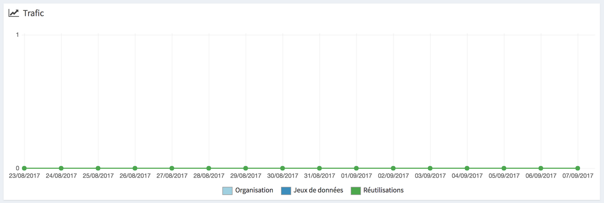
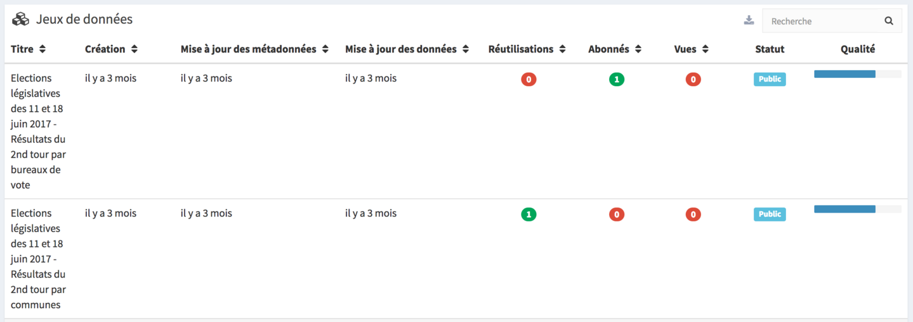
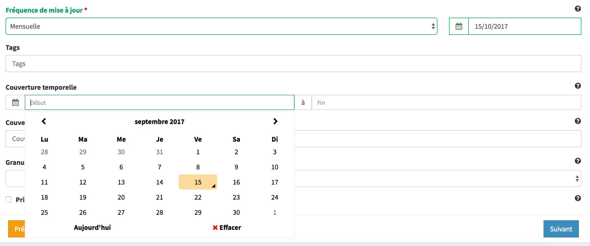
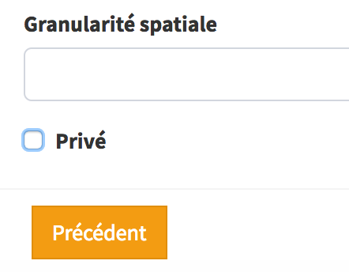
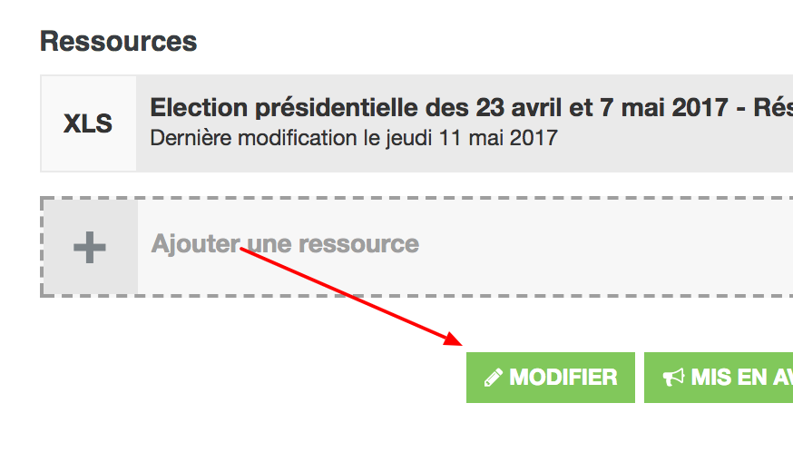
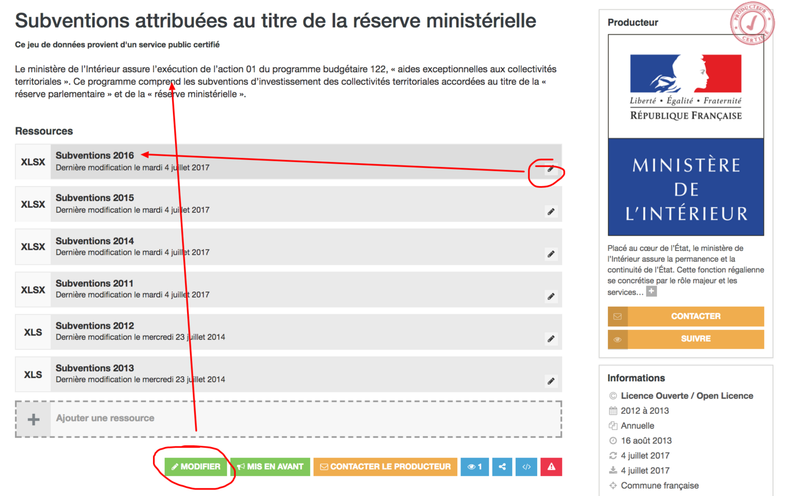
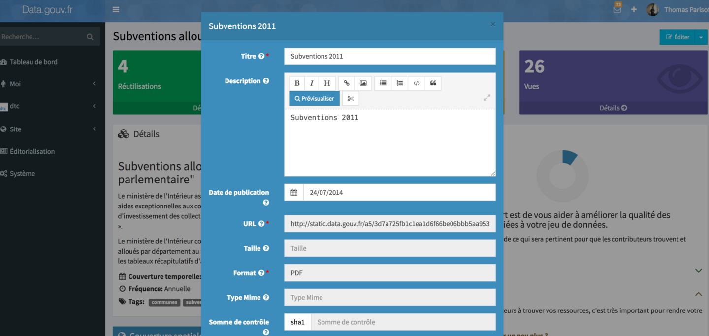
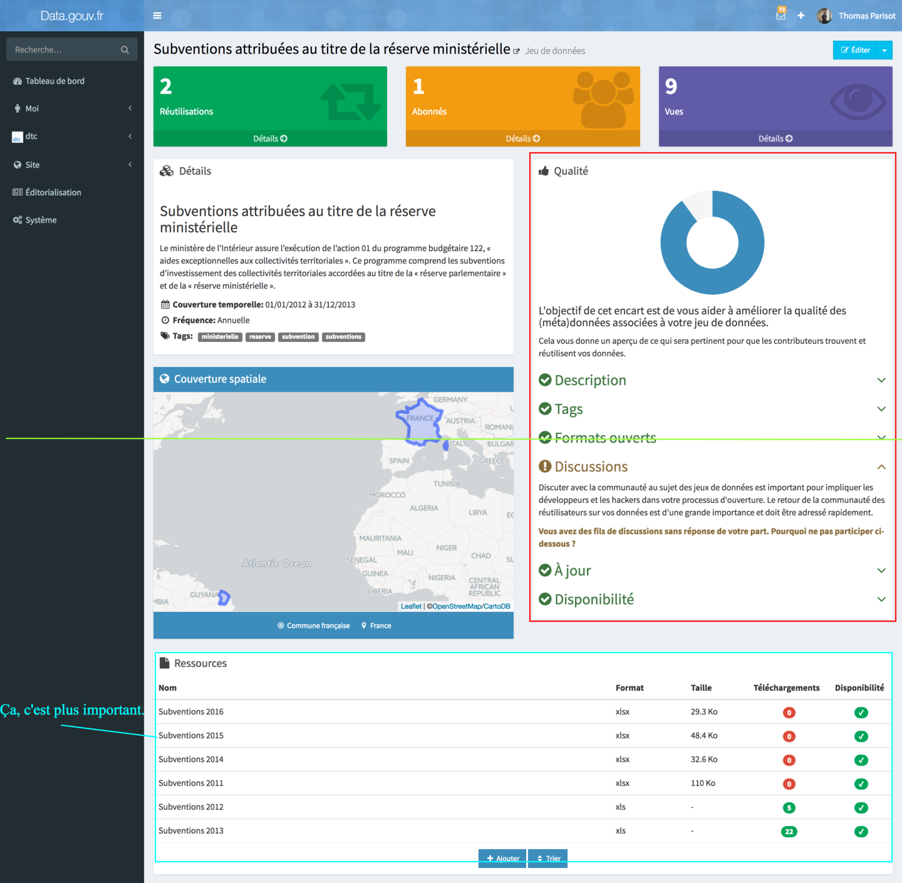
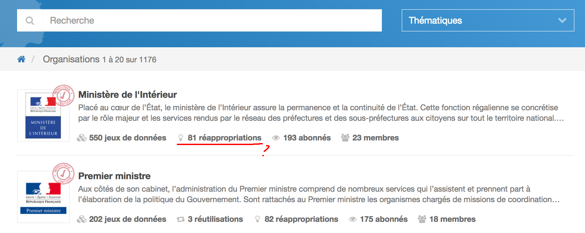
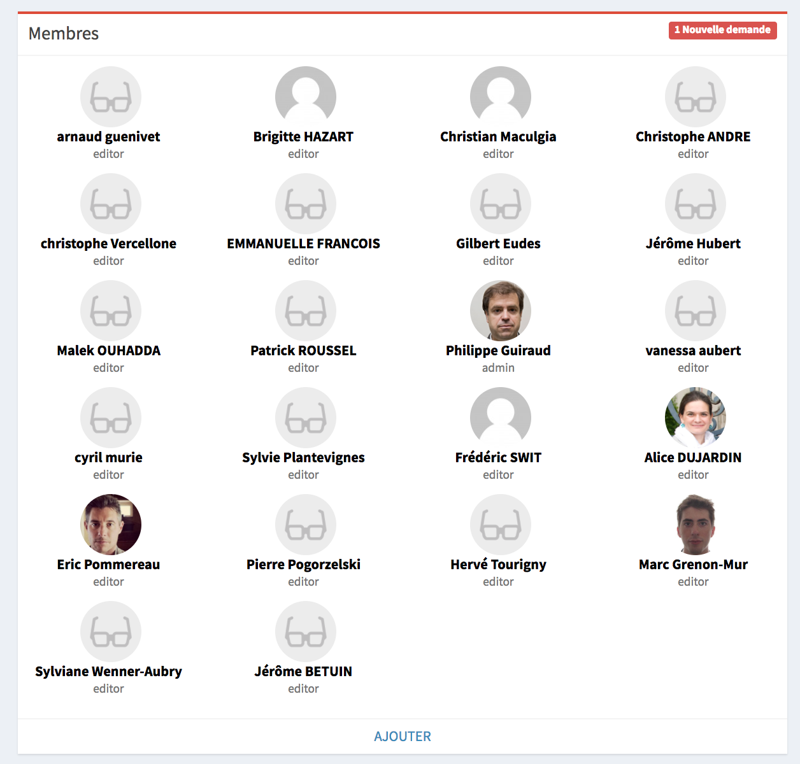

# Entretien avec Philippe Guiraud

## Présentation

Je suis conseiller auprès du délégué de l'information et de la communication (DICOM) ainsi que coordinateur Open Data pour le ministère de l'Intérieur.

Notre objectif avec l'Open Data est de contribuer à la transparence de l’action publique et ministérielle, de créer une **nouvelle relation avec les administrés et de favoriser l'innovation numérique**.

> Souvent dans les ministères ce sont les _services statistiques_ qui s'occupent de l'Open Data mais à l'Intérieur, cette mission revient à la _communication_.

Je suis impliqué dans l'Open Data depuis la création d'Etalab en 2011.

On met à disposition environ **550 jeux de données** ventilés dans les thématiques suivantes :

- notre cœur de métier : les **données électorales** ;
- de la **délinquance** granularité au département ;
- **sécurité routière** (accidentologie) — granularité fine ;
- **associations / liberté publique** avec le RNA (via la Loi pour la République Numérique) ;
- **collectivités territoriales / intercommunalité** et finances locales ;
- **sécurité civile**.

> Les anglais sont beaucoup plus précis que nous sur les chiffres de la délinquances (exemple sur [police.uk](https://www.met.police.uk/your-area/islington/mildmay/)) : la précision va jusqu'au quartier. Nous, nous  descendons au niveau du département. Question de culture. Mais cela peut évoluer à terme.

🗣 On n'a pas encore de stratégie d'Open Data par défaut mais on y travaille. On espère ouvrir 5 à 10 jeux de données important dans les 2 prochaines années.

🗣 On fonctionne en réseau au Ministère de l'Intérieur, avec des correspondants qui ouvrent les données.

## Thématique • Compréhension des données

🔍 "[effectifs police municipale](https://www.data.gouv.fr/fr/search/?q=effectifs+police+municipale)"

🔗 "[Police municipale : Effectifs par commune](https://www.data.gouv.fr/fr/datasets/police-municipale-effectifs-par-commune/)" (1er résultat)

> **Je passe par là parce que c'est plus simple, plus séduisant que de passer par l'admin**.

🤔 Je ne sais pas si l'abonnement marche bien. J'imagine qu'ils sont prévenus.

> Les gens de mon ministère ne savent pas toujours qu'il y a des réutilisations et que data.gouv.fr permet d’en voir.

💬 C'est bien d'avoir un retour, pour l'administration/producteurs. Ça démontre l'utilité de leur travail.

> Certains producteurs vont jusqu'à signaler les contributions et ressources communautaires en description.

## Thématique • Contributions des données

🗣 Certains jeux de données sont collectés manuellement, et plus rarement, automatiquement :

- le **fichier des effectifs de la police municipale** — le registre est collecté dans chaque commune, puis envoyé à la préfecture sous forme de fichiers Excel, 1 fois par an ;
- l'**application élections** — elle pourrait automatiquement publier sur data.gouv.fr.

---

> L'interface d'administration n'est **pas très collaborative**.

---

🔗 [Tableau de bord](https://www.data.gouv.fr/fr/admin/)

❓ Ça veut dire quoi _Disponibilité de vos jeux de données : 0%_ ?

❓ Quand je lis _23 abonnés_, c'est au niveau du Ministère de l'Intérieur ? Il me semblait qu'on en avait davantage…

❓ _1 réutilisation_ ? Il me semblait qu'on en avait produite davantage…

😤 D'ailleurs quand je clique dessus, **ça ne fait rien**.

😤 Avant on voyait des statistiques. Aujourd'hui, **je ne sais plus ce qu'il se passe**.

😤 Le _trafic_, il est toujours à zéro.

---

🗣 Parlons de la section _jeux de données_ de la page _tableau de bord_.

- les _vues_ : c'est utile ;
- le _statut_ : pas intéressant ;
- la _date de modification_ : **la date de couverture serait plus utile** pour savoir si je dois mettre à jour mes jeux de données ;
- la _date de création_ : peu intéressant ;
- la _date de mise à jour des métadonées_ : peu intéressant.

💬 Ça serait utile **de voir le nombre de téléchargements**, à date, de la dernière semaine ou du mois…

💬 Ça serait utile aussi **de voir le nombre d'anomalies en suspens** pour chaque jeu de données. Je ne vais pas cliquer sur les 500 jeux de données pour le savoir…

> Notre travail ce n'est pas _juste_ de mettre en ligne des données, c'est aussi de **comprendre ce qu'en fait le public** sinon on n'en sait rien.

💬 On est vraiment **intéressé de savoir ce qui fonctionne**.

---

🗣 Parlons de la section _anomalies_ de la page _tableau de bord_.

😤 **On ne sait pas si les anomalies ont été rectifiées, ni _combien_ il y en a.** On sait juste qu'il y en a, et qu'il faut aller les regarder une par une.

💬 Au niveau du _tableau de bord_, une **vue synthétique** serait plus utile, puis ensuite le **détail sur une page à part**.

😤 Quand on clique sur une anomalie, on est emmené vers une autre page et on ne peut même pas fermer la popup.

---

🗣 Parlons des _notifications_.

1. 👉 On en prend une au hasard ;
2. 𝐓 On ajoute un commentaire de test sur une anomalie ;
3. ❌ On ne peut pas supprimer son propre commentaire ;
4. 🤔 En fermant l'anomalie, le nombre de notifications est toujours à `73`, je ne comprends pas.

---

🗣 Parlons de la _création d'un jeu de données_.

1. Je choisis mon _organisation_ ;
2. Je choisis une _licence_ …

- 🤔 Je ne sais pas laquelle est la plus récente ;
- 💬 Il faudrait les licences mentionnées dans le décret [de la loi pour la République Numérique] ;
- 😤 La licence _Etalab_ n'y figure même pas, **c'est pourtant notre référence** ;
- 💬 J'avoue ne pas avoir assez de connaissance à leur égard, et **aucun service n'a émis d'avis** ;
- 🤔 C'est un problème de _sécurité_ si on applique la mauvaise licence.

💬 **La licence doit dédouaner l'administration des responsabilités liées à l'utilisation des données**, c'est ce qu'on veut. Les gens peuvent modifier les données, les utiliser avec d'autres données privées, dans des applications commerciales : c'est bien il faut que ça stimule l'économie et crée de l'emploi. Mais on ne veut pas que notre responsabilité soit engagée.

> La **licence officielle, c'est une garantie**.

3. Je choisis la _fréquence de mises à jour_ …

- 🎢 Il y en a **beaucoup, des fréquences** ;
- Les 🔗 "[données du RNA](https://www.data.gouv.fr/fr/datasets/repertoire-national-des-associations-rna/)", on les met à jour plusieurs fois par jour, **quasiment en temps réel**.

4. Je choisis les _tags_ …
    - 🗣 Je sais que ça **facilite les recherches**.
5. Je choisis la _couverture temporelle_ …

- 💬 Quand on a une fréquence annuelle, **ça fait beaucoup de champs à remplir**… d'ailleurs **on a aucune idée du jour de l'année** ;
- 😤 On ne va pas se coincer sur des dates qu'on ne connait pas.

6. Je choisis la _couverture spatiale_ …
    - 🗣 C'est important de mettre que ça concerne la France entière.

❓ **Pourquoi on choisirait de mettre un jeu de données _ouvert_ et _public_ en _privé_** ?

💬 Si c'était libellé _Brouillon_ à la place ? Ah oui, ça serait plus logique pour **préparer à la publication**, corriger les erreurs avant de mettre en ligne.

🗣 Ça nous est arrivé de **cocher la case Privé par erreur** et de ne pas comprendre pourquoi certains jeux de données n'apparaissaient pas.

---

🔗 "[Election présidentielle des 23 avril et 7 mai 2017 - Résultats définitifs du 2nd tour par communes](https://www.data.gouv.fr/fr/datasets/election-presidentielle-des-23-avril-et-7-mai-2017-resultats-definitifs-du-2nd-tour-par-communes/)"

1. 👉 Je sélectionne _Éditer_ ;
2. 👉 J'arrive dans l'admin et je dois **cliquer à nouveau** sur _Éditer_ ;
3. 😤 Quand je _ferme_ et clique sur le bouton _Précédent_ du navigateur, **la fenêtre de modification s'ouvre à nouveau**.

(...)

😤 C'est une boucle sans fin.

😤 C'est sans parler du positionnement des boutons ; c'est particulièrement difficile de se frayer un chemin.

---

🗣 Regardons la modification d'une ressource.

> L'interface me parait toute petite, très étroite.

❓ Type MIME c'est quoi ?

❓ Somme de contrôle c'est quoi ?

🗣 La _date de publication_, c'est le moment où on met en ligne sur data.gouv.fr.

🤔 Si on sait que la **date correspond aux dates de couverture du jeu de données** ? Non, l'information n'est pas présente à l'écran.

> La date de publication est un repère pour nous, car souvent on est en publication de l'année d'avant. (exemple : si la date de publication est le 2 février 2017, on sait qu'il s'agit des données couvrant l'année 2016).

---

🗣 Si je sais quels sont mes jeux de données qui n'ont pas été mis à jour ? **Non… je ne sais pas**.

💬 J'actualise quand je connais mais sinon **je n'ai pas de vision**.

💬 Pour piloter, gérer et suivre, j'ai besoin de savoir :

1. où en sont mes indicateurs ;
2. où en sont mes jeux de données ;
3. quel est l'état de mise à jour (rouge/orange/vert).

👍 Y'a du très bon boulot côté _front_, notamment avec l'ajout des _réutilisations_ mais **l'admin parait en friche**.

😤 La partie _Qualité_ mange la moitié de l'écran alors que l'information intéressante, elle est en bas (le tableau des ressources).

🙃 Et puis la partie _Audience_ ne fonctionne pas (et continue à prendre plein d'espace aussi).

---

> **Quand j'ai besoin de retrouver les données de mon ministère, je passe par le moteur de recherche**.

1. data.gouv.fr ;
2. 👉 "[Organisations](https://www.data.gouv.fr/fr/organizations/)" ;

🤔 D'ailleurs, c'est quoi ces _réappropriations_ ? C'est pareil que les _réutilisations_ ? Le tableau de bord n'en montrait qu'_une seule_ pourtant.

3. 👉 🔗 "[Ministère de l'intérieur](https://www.data.gouv.fr/fr/organizations/ministere-de-l-interieur/)" ;
4. 👉 "[voir les 550 jeux de données](https://www.data.gouv.fr/fr/datasets/?sort=-created&organization=534fff91a3a7292c64a77f53)"

❓ Ils sont classés comment les jeux de données, dans quel ordre — par date ? (c'est ce qu'il me semblerait le plus logique, et ce que je voudrais accessoirement).

> Si on avait les jeux de données les plus récents dans le tableau de bord, ça serait encore mieux.

---

🗣 Les emails de notifications en cas de commentaire ne sont pas très ciblés. Ils arrosent _toute_ l'organisation (23 personnes).

🗣 On a eu 73 anomalies en 4 ans. **Certains membres de l'administration se demandent ce que sont ces emails**. Surtout qu'ils ne peuvent pas y répondre.

---

🗣 Parlons de la gestion des membres de l'organisation.

🔗 "[Admin Ministère de l'Intérieur](https://www.data.gouv.fr/fr/admin/organization/534fff91a3a7292c64a77f53/)"

🗣 Je suis le seul administrateur, j'ajoute les personnes chargées des différents services du ministère et ils gèrent leurs jeux de données respectifs. Ça se fait sur un _accord oral_.

👍 **La nouvelle plate-forme est beaucoup plus facile pour publier**. C'est le jour et la nuit.

---

> **Les stats, ça me manque**.

💬 Au final ça serait pas mal si c'était plus facile de _suivre_, de _piloter_ et de _répondre_ aux diverses demandes (commentaires, anomalies).

## Thématique • Communauté des données

🗣 Par exemple, je clique sur 🔗 [_mon profil_](https://www.data.gouv.fr/fr/users/philippe-guiraud/) :

1. 👀 liste de mes dernières activités ;
2. 👉 "[31 suivis](https://www.data.gouv.fr/fr/users/philippe-guiraud/following/)"
❓ Ce sont les jeux de données suivis par le Ministère de l'Intérieur ? Je dis ça parce que je suis administrateur de cette organisation.

3. 👉 "[1 jeu de données](https://www.data.gouv.fr/fr/users/philippe-guiraud/datasets/)"
🤔 Il n'y a aucun de listés dans la page et pourtant il me semblait en avoir créé 2 à mon nom.

🤔 Qu'est-ce qu'on peut voir sur son profil à part sa photo ?

---

❓ On fait comment pour savoir si on peut se servir des réutilisations ?

> On pourrait les réutiliser/se les réapproprier/les adapter mais **on ne sait pas si on a le droit**.

## Conclusion

😊 Je suis content d'avoir vu quelqu'un d'Etalab pour faire avancer les choses.

> Ce sera un entretien utile si on voit des changements dans les prochaines semaines, dans les prochains mois.
